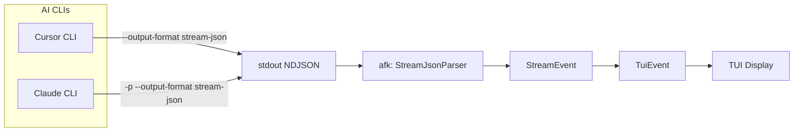

# Real-Time AI Output via Stream JSON

## Status: ✓ Implemented

## Problem

In headless/print mode, AI CLIs buffer output and only emit at completion (2-5 minutes of silence). Users see nothing while the AI works.

## Solution

Use **`--output-format stream-json`** (NDJSON) which streams events as they happen. Parse the JSON events and display them in a simplified TUI.

Both major AI CLIs support the same NDJSON streaming format:

| CLI | Docs | Streaming Flags |
|-----|------|-----------------|
| **Cursor** | [cursor.com/docs/cli/reference/output-format](https://cursor.com/docs/cli/reference/output-format) | `--print --output-format stream-json` (add `--stream-partial-output` for char-level) |
| **Claude** | [code.claude.com/docs/en/cli-reference](https://code.claude.com/docs/en/cli-reference) | `-p --output-format stream-json` (add `--include-partial-messages` for char-level) |

**Note:** Thinking/reasoning is suppressed in print mode per both docs, but we get assistant messages and all tool activity.

## Implementation

### Configuration

The `AiCliConfig` now includes:

```rust
pub struct AiCliConfig {
    pub command: String,
    pub args: Vec<String>,
    pub output_format: AiOutputFormat,  // Text | Json | StreamJson (default)
    pub stream_partial: bool,            // Enable character-level streaming
}
```

The CLI automatically appends the correct streaming flags via `full_args()`:

- **Cursor**: `--output-format stream-json` (and `--stream-partial-output` if enabled)
- **Claude**: `--output-format stream-json` (and `--include-partial-messages` if enabled)

### Unified NDJSON Parser

`src/parser/stream_json.rs` provides:

```rust
pub struct StreamJsonParser { ... }

pub enum StreamEvent {
    SystemInit { model: Option<String>, tools: Vec<String> },
    UserMessage { text: String },
    AssistantMessage { text: String },
    ToolStarted { tool_name: String, tool_type: ToolType, path: Option<String> },
    ToolCompleted { tool_name: String, tool_type: ToolType, path: Option<String>, success: bool, lines: Option<u32> },
    Result { success: bool, duration_ms: Option<u64>, summary: Option<String> },
    Error { message: String },
    Unknown { event_type: String },
}
```

The parser auto-detects CLI format (Cursor vs Claude) from the first line and normalises both to `StreamEvent`.

### Event Types Displayed

| Event | Display |
|-------|---------|
| `assistant` | Show message text (what AI is saying/planning) |
| `tool_call.started` | Show "→ Reading file.txt..." or "→ Writing file.txt..." |
| `tool_call.completed` | Show "✓ Read 142 lines" or "✓ Wrote 156 lines" |
| `result` | Show completion summary |

### Event Structure Comparison

**Cursor CLI events:**

```json
{"type":"assistant","message":{"content":[{"type":"text","text":"I'll read..."}]}}
{"type":"tool_call","subtype":"started","tool_call":{"readToolCall":{"args":{"path":"file.txt"}}}}
{"type":"tool_call","subtype":"completed","tool_call":{"readToolCall":{"result":{"success":{...}}}}}
{"type":"result","subtype":"success","result":"...","duration_ms":1234}
```

**Claude CLI events:**

```json
{"type":"assistant","message":{"role":"assistant","content":[{"type":"text","text":"..."}]}}
{"type":"tool_use","name":"Read","input":{"path":"file.txt"}}
{"type":"tool_result","tool_use_id":"...","content":"..."}
{"type":"result","subtype":"success",...}
```

## Architecture



## TUI Layout (Simplified)

```
┌─────────────────────────────────────────────────────────────────────────────┐
│ ◉ afk │ ⠋ Iteration 3/10 │ 02:34 │ 12 calls │ 5 files │ task-001          │
├─────────────────────────────────────────────────────────────────────────────┤
│ Assistant: I'll read the configuration file first...                        │
│ → Reading src/config.rs                                                     │
│ ✓ Read 142 lines                                                            │
│ Assistant: Now I'll update the function to handle the edge case...          │
│ → Writing src/config.rs                                                     │
│ ✓ Wrote 156 lines (+14)                                                     │
│ Assistant: Let me also update the tests...                                  │
│                                                                             │
├─────────────────────────────────────────────────────────────────────────────┤
│ ↑↓ scroll │ q quit                                                          │
└─────────────────────────────────────────────────────────────────────────────┘
```

The layout uses:
- **Header bar (2 lines)**: Iteration, time, tool calls, files, task ID
- **Output pane (full width)**: Scrollable AI output with colour coding
- **Footer (2 lines)**: Keyboard shortcuts

## Files Modified

| File | Changes |
|------|---------|
| `src/parser/stream_json.rs` | New unified NDJSON parser with Cursor/Claude support |
| `src/parser/mod.rs` | Export StreamJsonParser, StreamEvent, ToolType, CliFormat |
| `src/config/mod.rs` | Add AiOutputFormat enum, output_format and stream_partial fields to AiCliConfig, full_args() helper |
| `src/runner/iteration.rs` | Parse NDJSON via StreamJsonParser, emit TuiEvents |
| `src/runner/controller.rs` | Wire NDJSON parsing into TUI runner loop |
| `src/tui/ui.rs` | Simplify layout: header bar + full-width output |

## CLI Configuration

Streaming is enabled by default. Config auto-detects CLI and applies appropriate flags:

```json
{
  "ai_cli": {
    "command": "cursor",
    "args": ["--print"],
    "output_format": "stream-json",
    "stream_partial": false
  }
}
```

For legacy text-only output (no streaming):

```json
{
  "ai_cli": {
    "command": "cursor",
    "args": ["--print"],
    "output_format": "text"
  }
}
```

## Usage

```bash
afk go           # Uses stream-json by default, shows real-time output
afk go --tui     # Full TUI mode with scrollable output
```

## Scope & Limitations

- **In scope:** Cursor and Claude CLI stream-json parsing, unified event model, TUI simplification
- **Future:** Aider streaming support (different output format, would need separate adapter)
- **Limitation:** Internal thinking/reasoning not available per both CLI docs — we only see assistant messages and tool activity, not the underlying chain-of-thought
