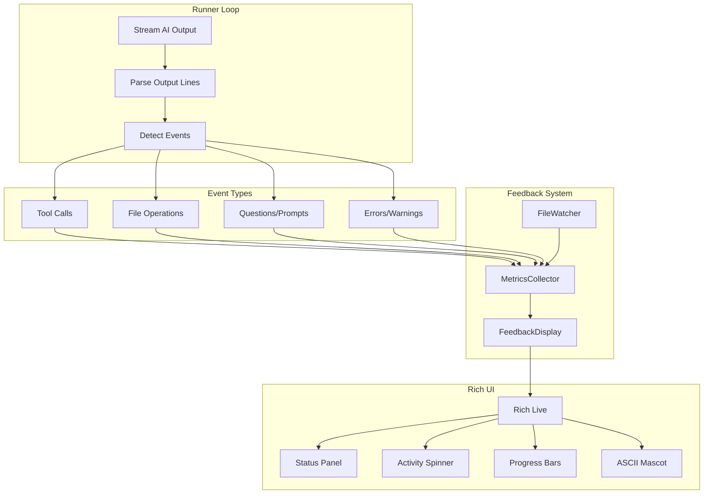

# Live CLI Feedback System for afk

Replace the current black-box experience during afk iterations with an engaging, informative display showing AI activity, file changes, session progress, and connection health in real-time.

## Problem

When afk runs iterations, the CLI shows AI output but provides no insight into what's actually happening. Users can't tell:

- Is the AI making progress or spinning its wheels?
- What files are being changed?
- How many tool calls has it made?
- Is the connection healthy or has it stalled?
- How long until this iteration might complete?

The experience feels opaque and anxiety-inducing, especially for longer sessions.

## Solution

Add a live feedback panel that runs alongside AI output, showing real-time metrics and status. Use Rich's Live display capabilities to create an animated, informative sidebar or header that updates as the AI works.

## Architecture



## Display Layout

The feedback display appears as a persistent header during iteration execution:

```
┌─────────────────────────────────────────────────────────────────────┐
│  ◉ afk running                              Iteration 3/10  02:34   │
│                                                                     │
│  ╭─ Activity ────────────────────╮  ╭─ Files ─────────────────────╮ │
│  │  ⣾ Working...                 │  │  ✎ src/auth/login.py       │ │
│  │                               │  │  ✎ tests/test_auth.py      │ │
│  │  Tool calls: 47               │  │  + src/auth/utils.py       │ │
│  │  Files touched: 3             │  │                            │ │
│  │  Lines changed: +89 / -12     │  │                            │ │
│  ╰───────────────────────────────╯  ╰────────────────────────────╯ │
│                                                                     │
│  Task: US-042 "Implement login flow"                    ████░░ 67%  │
└─────────────────────────────────────────────────────────────────────┘
```

### Alternative: Minimal Mode

For users who prefer less chrome:

```
◉ afk [3/10] 02:34 │ ⣾ 47 calls │ 3 files │ +89/-12 │ US-042 ████░░ 67%
```

## Files to Create/Modify

### 1. New Module: Feedback Display

| File | Purpose |
|------|---------|
| [`src/afk/feedback.py`](src/afk/feedback.py) | Core feedback display system with `MetricsCollector`, `FeedbackDisplay`, and ASCII art components |

**Key Classes:**

```python
@dataclass
class IterationMetrics:
    """Metrics collected during a single iteration."""
    tool_calls: int = 0
    files_modified: list[str] = field(default_factory=list)
    files_created: list[str] = field(default_factory=list)
    files_deleted: list[str] = field(default_factory=list)
    lines_added: int = 0
    lines_removed: int = 0
    errors: int = 0
    warnings: int = 0
    last_activity: datetime | None = None


class MetricsCollector:
    """Collects metrics from AI output and file system changes."""
    
    def parse_line(self, line: str) -> None:
        """Parse a line of AI output for relevant events."""
    
    def record_tool_call(self, tool_name: str) -> None:
        """Record a tool call."""
    
    def record_file_change(self, path: str, change_type: str) -> None:
        """Record a file modification/creation/deletion."""


class FeedbackDisplay:
    """Rich Live display for real-time feedback."""
    
    def start(self) -> None:
        """Start the live display."""
    
    def update(self, metrics: IterationMetrics) -> None:
        """Update the display with current metrics."""
    
    def stop(self) -> None:
        """Stop the live display."""
```

### 2. Output Parser

| File | Purpose |
|------|---------|
| [`src/afk/output_parser.py`](src/afk/output_parser.py) | Parse AI CLI output to detect tool calls, file operations, and other events |

**Patterns to Detect:**

- Tool call markers (varies by AI CLI - Claude Code, Cursor, Aider, etc.)
- File path mentions with modification indicators
- Error/warning patterns
- Progress indicators
- Completion signals (already handled, extend detection)

```python
class OutputParser:
    """Parse AI output for metrics and events."""
    
    # Patterns for different AI CLIs
    PATTERNS = {
        "claude": {
            "tool_call": r"Calling tool: (\w+)",
            "file_write": r"Writing to: (.+)",
            "file_read": r"Reading: (.+)",
        },
        "cursor": {
            "tool_call": r"<tool>(\w+)</tool>",
            "file_change": r"(?:Edited|Created|Deleted): (.+)",
        },
        # ... other CLI patterns
    }
    
    def parse(self, line: str) -> list[Event]:
        """Parse a line and return detected events."""
```

### 3. File Watcher

| File | Purpose |
|------|---------|
| [`src/afk/file_watcher.py`](src/afk/file_watcher.py) | Monitor file system for changes during iteration (backup to output parsing) |

**Implementation:**

Use `watchdog` library (add to dependencies) to monitor the project directory for file changes. This provides ground truth when output parsing misses changes.

```python
class FileWatcher:
    """Watch for file system changes during iteration."""
    
    def __init__(self, root: Path, ignore_patterns: list[str]) -> None:
        """Initialize watcher with root directory and ignore patterns."""
    
    def start(self) -> None:
        """Start watching for changes."""
    
    def get_changes(self) -> list[FileChange]:
        """Get accumulated changes since last call."""
    
    def stop(self) -> None:
        """Stop watching."""
```

### 4. ASCII Art Components

| File | Purpose |
|------|---------|
| [`src/afk/art.py`](src/afk/art.py) | ASCII art mascots and celebratory animations |

**Mascot States:**

```
Working:          Success:          Error:            Waiting:
   ◠‿◠              ◠◡◠               ◠_◠               ◠.◠
  /|█|\            \|█|/             /|█|\             /|█|\
   / \              / \               / \               / \

Celebration (task complete):
    \◠◡◠/
     |█|
     / \
   ★ ★ ★
```

**Spinner Frames:**

```python
SPINNERS = {
    "dots": ["⣾", "⣽", "⣻", "⢿", "⡿", "⣟", "⣯", "⣷"],
    "arrows": ["←", "↖", "↑", "↗", "→", "↘", "↓", "↙"],
    "bounce": ["⠁", "⠂", "⠄", "⠂"],
    "pulse": ["◐", "◓", "◑", "◒"],
}
```

### 5. Modify Runner

| File | Modification |
|------|--------------|
| [`src/afk/runner.py`](src/afk/runner.py) | Integrate feedback display into `IterationRunner` and `OutputHandler` |

**Changes:**

1. Add `FeedbackDisplay` to `OutputHandler`
2. Add `MetricsCollector` to `IterationRunner`
3. Parse each output line through `OutputParser`
4. Update display on each line

```python
class OutputHandler:
    def __init__(
        self,
        console: Console | None = None,
        completion_signals: list[str] | None = None,
        feedback_enabled: bool = True,  # NEW
        feedback_mode: str = "full",    # NEW: "full", "minimal", "off"
    ) -> None:
        ...
        self.feedback = FeedbackDisplay(console) if feedback_enabled else None
        self.metrics = MetricsCollector()
        self.parser = OutputParser()

    def stream_line(self, line: str) -> None:
        """Output a streamed line with metrics parsing."""
        # Parse for events
        events = self.parser.parse(line)
        for event in events:
            self.metrics.record(event)
        
        # Update display
        if self.feedback:
            self.feedback.update(self.metrics.current)
        
        # Original output
        self.console.print(line, end="")
```

### 6. Configuration

| File | Modification |
|------|--------------|
| [`src/afk/config.py`](src/afk/config.py) | Add feedback configuration options |

```python
class FeedbackConfig(BaseModel):
    """Configuration for CLI feedback display."""
    enabled: bool = True
    mode: Literal["full", "minimal", "off"] = "full"
    show_files: bool = True
    show_metrics: bool = True
    show_mascot: bool = True
    refresh_rate: float = 0.1  # seconds
```

### 7. Dependencies

| File | Modification |
|------|--------------|
| [`pyproject.toml`](pyproject.toml) | Add `watchdog` dependency for file system monitoring |

```toml
dependencies = [
    # ... existing deps
    "watchdog>=3.0",
]
```

## Event Detection

### Tool Call Detection

Different AI CLIs have different output formats. The parser should handle:

| CLI | Pattern Example |
|-----|-----------------|
| Claude Code | `Calling tool: write_file` |
| Cursor | Tool calls wrapped in XML-like tags |
| Aider | `/add`, `/edit` commands |
| Continue | Similar to Claude Code |

### File Change Detection

Primary: Parse output for file operation mentions
Backup: File system watcher catches anything missed

### Activity Detection

- **Active**: Output received in last 2 seconds
- **Thinking**: No output for 2-10 seconds
- **Stalled**: No output for 10+ seconds (show warning)

## User Controls

### CLI Flags

```bash
afk go --feedback full      # Full display (default)
afk go --feedback minimal   # One-line status bar
afk go --feedback off       # No feedback (raw output only)
afk go --no-mascot          # Disable ASCII mascot
```

### Runtime Controls

While running, users can:
- Press `m` to toggle between full/minimal mode
- Press `q` to quit gracefully
- Press `s` to show/hide statistics

## Celebratory Moments

Add delightful feedback for positive events:

1. **Task Complete**: Brief animation, increment counter with flair
2. **Quality Gates Pass**: Green checkmarks cascade
3. **Session Complete**: Celebration ASCII art

```
╔══════════════════════════════════════════════╗
║                                              ║
║     ★ ★ ★  ALL TASKS COMPLETE!  ★ ★ ★        ║
║                                              ║
║              \◠◡◠/                            ║
║               |█|     5 tasks done            ║
║               / \     23 iterations           ║
║             ★     ★   47 minutes              ║
║                                              ║
╚══════════════════════════════════════════════╝
```

## Error States

Visual feedback for problems:

1. **Connection Lost**: Red spinner, "Reconnecting..."
2. **AI Error**: Orange warning, show error excerpt
3. **Quality Gate Failed**: List failed gates, continue indicator

## Testing

| Test File | Coverage |
|-----------|----------|
| `tests/test_feedback.py` | `FeedbackDisplay`, `MetricsCollector` |
| `tests/test_output_parser.py` | Output parsing for all supported CLIs |
| `tests/test_file_watcher.py` | File system change detection |
| `tests/test_art.py` | ASCII art rendering |

## Implementation Order

1. Create `src/afk/feedback.py` with `IterationMetrics` and `MetricsCollector`
2. Create `src/afk/output_parser.py` with basic pattern detection
3. Create `src/afk/art.py` with spinners and mascot states
4. Create `src/afk/file_watcher.py` with watchdog integration
5. Add `FeedbackConfig` to `src/afk/config.py`
6. Create `FeedbackDisplay` with Rich Live integration
7. Integrate into `src/afk/runner.py`
8. Add CLI flags for feedback control
9. Write tests for all new modules
10. Add `watchdog` to `pyproject.toml`

## Future Enhancements

- **Sound Effects**: Optional audio feedback for events
- **Desktop Notifications**: Alert when session completes (useful for long runs)
- **Web Dashboard**: Real-time metrics via local web server
- **Metrics Export**: Save session metrics to JSON for analysis
- **Custom Themes**: User-defined colour schemes and mascots
