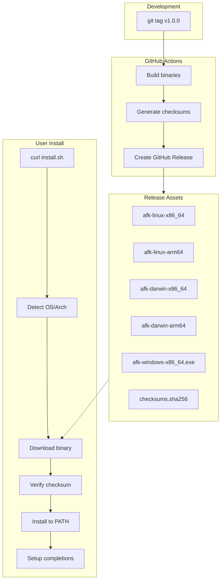

# Native Install System for afk

Implement a frictionless installation experience across macOS, Windows, and Linux using standalone binaries built with PyInstaller, distributed via GitHub Releases, and installed via curl/irm one-liners.

## Architecture



## Files to Create

### 1. Install Scripts

| File | Purpose |

|------|---------|

| [`scripts/install.sh`](scripts/install.sh) | Unix installer (macOS/Linux) - detects OS/arch, downloads binary, verifies checksum, installs to `~/.local/bin`, sets up completions |

| [`scripts/install.ps1`](scripts/install.ps1) | Windows installer - same flow but for PowerShell, installs to `%LOCALAPPDATA%\afk\bin` |

**Install commands:**

```bash
# Stable (macOS/Linux)
curl -fsSL https://raw.githubusercontent.com/m0nkmaster/afk/main/scripts/install.sh | bash

# Beta (macOS/Linux)
curl -fsSL https://raw.githubusercontent.com/m0nkmaster/afk/main/scripts/install.sh | bash -s -- --beta

# Windows
irm https://raw.githubusercontent.com/m0nkmaster/afk/main/scripts/install.ps1 | iex
```

### 2. GitHub Actions Workflows

| File | Purpose |

|------|---------|

| [`.github/workflows/build.yml`](.github/workflows/build.yml) | CI - runs tests, lint, type checks on PRs and main |

| [`.github/workflows/release.yml`](.github/workflows/release.yml) | CD - triggered by tags, builds binaries for all platforms, creates GitHub Release |

**Release workflow:**

- Tags like `v1.0.0` create stable releases (marked "Latest")
- Tags like `v1.0.0-beta.1` create pre-releases
- Builds 5 binaries: linux-x86_64, linux-arm64, darwin-x86_64, darwin-arm64, windows-x86_64
- Generates SHA256 checksums for verification

### 3. Self-Update Command

Add to [`src/afk/cli.py`](src/afk/cli.py):

```python
@main.command()
@click.option("--beta", is_flag=True, help="Update to beta channel")
def update(beta: bool) -> None:
    """Update afk to the latest version."""
```

This will:

- Check current version against GitHub Releases API
- Download new binary if available
- Replace current binary in-place
- Report success/failure

### 4. Shell Completions

Add completion generation to [`src/afk/cli.py`](src/afk/cli.py):

```python
@main.command()
@click.argument("shell", type=click.Choice(["bash", "zsh", "fish"]))
def completions(shell: str) -> None:
    """Generate shell completions."""
```

The install script will automatically run this and add to appropriate shell config.

### 5. Dependencies Update

Update [`pyproject.toml`](pyproject.toml):

- Add `pyinstaller` to dev dependencies
- Add entry point configuration for PyInstaller

### 6. README Update

Update [`README.md`](README.md) Installation section with new curl commands, replacing the current pipx/pip instructions as the primary method.

## Platform Matrix

| Platform | Architecture | Binary Name | Runner |

|----------|--------------|-------------|--------|

| Linux | x86_64 | `afk-linux-x86_64` | ubuntu-latest |

| Linux | arm64 | `afk-linux-arm64` | ubuntu-24.04-arm |

| macOS | Intel | `afk-darwin-x86_64` | macos-13 |

| macOS | Apple Silicon | `afk-darwin-arm64` | macos-latest |

| Windows | x86_64 | `afk-windows-x86_64.exe` | windows-latest |

## Release Workflow

```bash
# Stable release
git tag v0.2.0
git push origin v0.2.0

# Beta release  
git tag v0.2.0-beta.1
git push origin v0.2.0-beta.1
```

## Implementation Order

1. Create GitHub Actions workflows (build.yml, release.yml)
2. Create install scripts (install.sh, install.ps1)
3. Add `afk update` command
4. Add `afk completions` command
5. Update pyproject.toml with PyInstaller
6. Update README with new install instructions
7. Test locally with PyInstaller
8. Create first beta release to verify pipeline