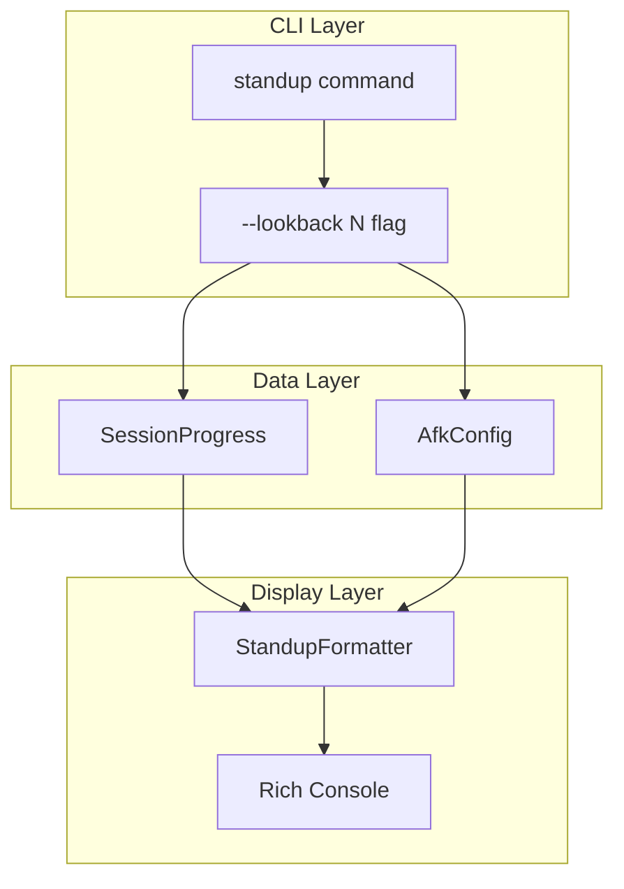

# Daily Standup Command for afk

Add an `afk standup` command that outputs a human-friendly summary of recent work, mimicking a dev team's daily standup format.

## Problem

When returning to a project or checking on autonomous progress, users have no quick way to see:

- What tasks have been completed recently
- What's currently being worked on and how long it's taking
- What the AI has learned during recent work

Users must manually inspect `progress.json` or dig through git logs to piece together session state.

## Solution

Add `afk standup` - a command that outputs a nicely formatted summary showing:

1. **Yesterday** (recent completed work) - Last N completed tasks with duration
2. **Today** (current work) - In-progress task with elapsed time and estimate
3. **Learnings** (blockers/insights) - Recent learnings from completed tasks

## Display Format

```
╭──────────────────────────────────────────────────────────────────╮
│  📋 afk standup                                    11 Jan 2026   │
╰──────────────────────────────────────────────────────────────────╯

✅ Completed
───────────────────────────────────────────────────────────────────
  • add-user-auth-flow                              12m 34s
  • fix-database-connection                          3m 12s  
  • update-readme-docs                               1m 45s

🔄 In Progress
───────────────────────────────────────────────────────────────────
  • implement-api-endpoints                    elapsed: 5m 23s
    Started at 14:32

💡 Recent Learnings
───────────────────────────────────────────────────────────────────
  • The auth module requires explicit session cleanup
  • Database pool size should be at least 10 for tests
  • API rate limiting is handled by middleware, not endpoints
```

### Minimal Mode

When no tasks are tracked:

```
╭──────────────────────────────────────────────────────────────────╮
│  📋 afk standup                                    11 Jan 2026   │
╰──────────────────────────────────────────────────────────────────╯

No session data found. Run `afk go` to start working.
```

## Architecture



## Files to Modify

### 1. Configuration

| File | Modification |
|------|--------------|
| [`src/afk/config.py`](src/afk/config.py) | Add `StandupConfig` with configurable lookback count |

**New Config:**

```python
class StandupConfig(BaseModel):
    """Configuration for standup display."""
    lookback: int = 3
    """Number of recent completed tasks to show."""
```

**Add to AfkConfig:**

```python
class AfkConfig(BaseModel):
    # ... existing fields ...
    standup: StandupConfig = Field(default_factory=StandupConfig)
```

### 2. CLI Command

| File | Modification |
|------|--------------|
| [`src/afk/cli.py`](src/afk/cli.py) | Add `standup` command |

**Command signature:**

```python
@main.command()
@click.option(
    "--lookback", "-n",
    type=int,
    default=None,
    help="Number of recent completed tasks to show (default: from config or 3)"
)
def standup(lookback: int | None) -> None:
    """Show daily standup summary of recent work."""
```

### 3. Standup Formatter (New File)

| File | Purpose |
|------|---------|
| [`src/afk/standup.py`](src/afk/standup.py) | Formatting and display logic for standup output |

**Key Components:**

```python
from dataclasses import dataclass
from datetime import datetime
from rich.console import Console
from rich.panel import Panel
from rich.table import Table


@dataclass
class CompletedTaskSummary:
    """Summary of a completed task for display."""
    id: str
    duration_seconds: float | None
    completed_at: datetime | None


@dataclass
class InProgressTaskSummary:
    """Summary of in-progress task for display."""
    id: str
    started_at: datetime | None
    elapsed_seconds: float


@dataclass
class StandupData:
    """All data needed for standup display."""
    completed_tasks: list[CompletedTaskSummary]
    in_progress_task: InProgressTaskSummary | None
    learnings: list[str]
    session_started: datetime | None
    total_iterations: int


def gather_standup_data(
    progress: SessionProgress,
    lookback: int = 3,
) -> StandupData:
    """Gather standup data from session progress.
    
    Args:
        progress: Current session progress
        lookback: Number of recent completed tasks to include
        
    Returns:
        StandupData with formatted summaries
    """


def format_duration(seconds: float) -> str:
    """Format seconds as human-readable duration.
    
    Examples:
        - 45 -> "45s"
        - 90 -> "1m 30s"
        - 3665 -> "1h 1m 5s"
    """


def render_standup(data: StandupData, console: Console | None = None) -> None:
    """Render standup to console using Rich formatting.
    
    Args:
        data: Standup data to display
        console: Rich console (uses default if not provided)
    """
```

### 4. Progress Module Enhancement

| File | Modification |
|------|--------------|
| [`src/afk/progress.py`](src/afk/progress.py) | Add helper methods for standup data retrieval |

**New methods on SessionProgress:**

```python
def get_recent_completed(self, count: int = 3) -> list[TaskProgress]:
    """Get the N most recently completed tasks, sorted by completion time."""
    completed = [t for t in self.tasks.values() if t.status == "completed"]
    # Sort by completed_at descending
    completed.sort(
        key=lambda t: t.completed_at or "",
        reverse=True,
    )
    return completed[:count]


def get_in_progress_task(self) -> TaskProgress | None:
    """Get the currently in-progress task (if any)."""
    in_progress = [t for t in self.tasks.values() if t.status == "in_progress"]
    return in_progress[0] if in_progress else None


def get_recent_learnings(self, task_count: int = 3) -> list[str]:
    """Get learnings from the N most recently completed tasks."""
    recent = self.get_recent_completed(task_count)
    learnings = []
    for task in recent:
        learnings.extend(task.learnings)
    return learnings
```

## Duration Calculation

Task duration is calculated as:

- **Completed tasks**: `completed_at - started_at`
- **In-progress tasks**: `now - started_at`

Both timestamps are ISO format strings stored in `TaskProgress`. Handle edge cases:

- If `started_at` is None, duration is unknown (show "—")
- If `completed_at` is None for completed task, duration is unknown

## Configuration

Add to `.afk/config.json`:

```json
{
  "standup": {
    "lookback": 3
  }
}
```

The `--lookback` CLI flag overrides the config value.

## Testing

| Test File | Coverage |
|-----------|----------|
| `tests/test_standup.py` | `gather_standup_data`, `format_duration`, `render_standup` |
| `tests/test_cli.py` | Add tests for `standup` command |
| `tests/test_progress.py` | Add tests for new helper methods |

**Test scenarios:**

1. No session data (empty progress)
2. Only completed tasks, no in-progress
3. In-progress task with no completed
4. Full standup with all sections
5. Tasks with missing timestamps
6. Duration formatting edge cases (seconds, minutes, hours)
7. Lookback count configuration

## Implementation Order

1. Add `StandupConfig` to `src/afk/config.py`
2. Add helper methods to `SessionProgress` in `src/afk/progress.py`
3. Create `src/afk/standup.py` with data gathering and formatting
4. Add `standup` command to `src/afk/cli.py`
5. Write tests for all new code
6. Update `USAGE.md` with standup command documentation

## Edge Cases

- **Empty session**: Show helpful message directing user to `afk go`
- **No completed tasks**: Skip "Completed" section entirely
- **No in-progress task**: Skip "In Progress" section
- **No learnings**: Skip "Learnings" section
- **Invalid timestamps**: Show duration as "—" rather than failing
- **Very long task IDs**: Truncate with ellipsis at ~40 chars

## Future Enhancements

- **Team mode**: Aggregate standups from multiple sessions/branches
- **Slack integration**: Post standup to a channel
- **Historical view**: Show standup for a specific date
- **JSON output**: `afk standup --json` for scripting
- **Estimate accuracy**: Track estimated vs actual durations over time
